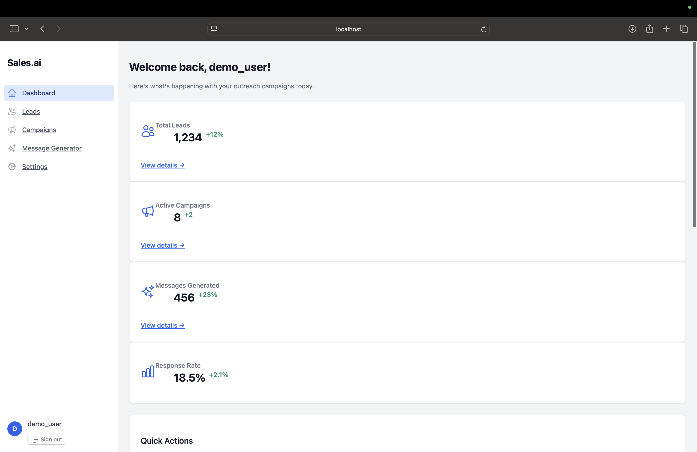
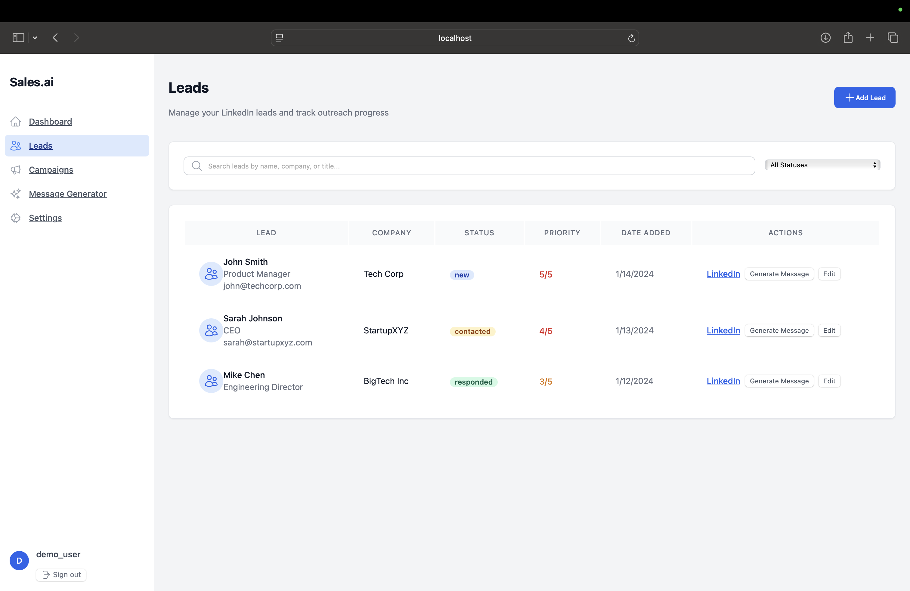
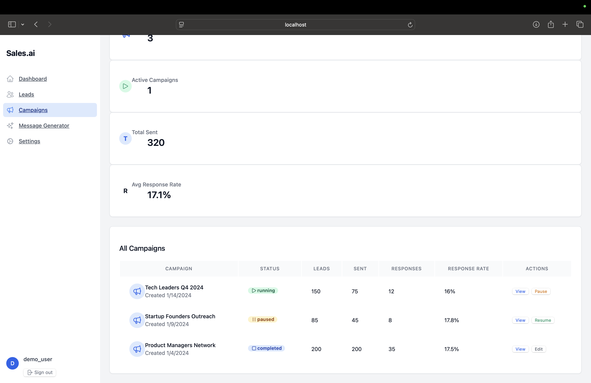
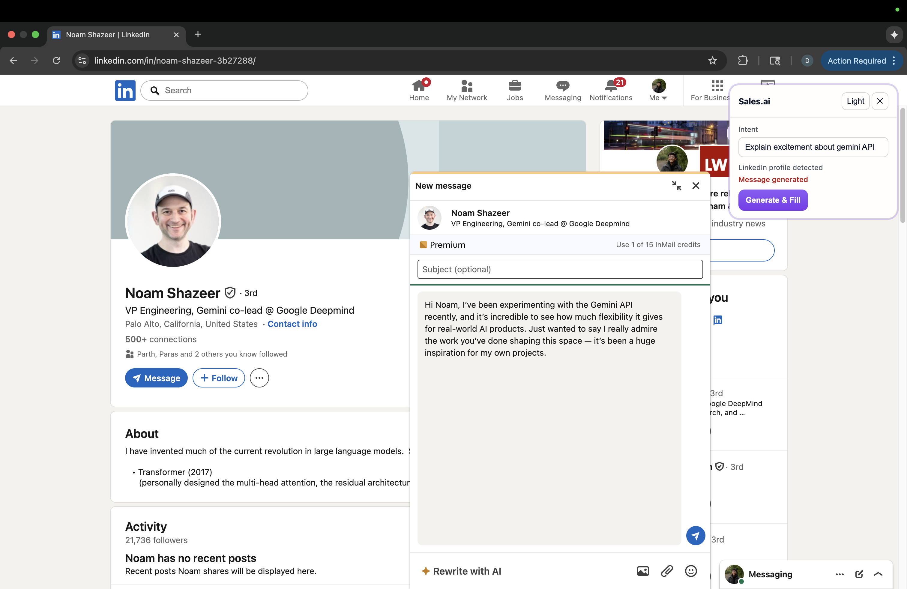
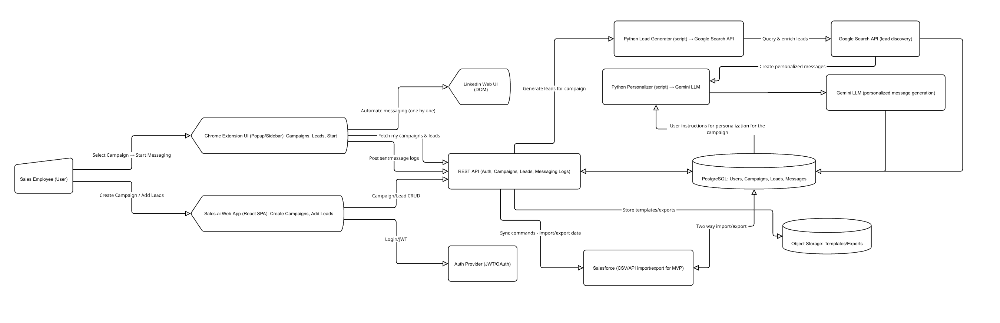

# Sales.ai - AI-Powered LinkedIn Outreach Platform

Sales.ai is a comprehensive platform for LinkedIn outreach automation that combines a modern web application with a Chrome extension for seamless message generation and campaign management.

## Features

### Web Application
- **User Authentication**: Secure login/register with Google OAuth support
- **Dashboard**: Overview of campaigns, leads, and performance metrics
- **Lead Management**: Import, organize, and track LinkedIn leads
- **Campaign Management**: Create and manage outreach campaigns
- **AI Message Generator**: Generate personalized LinkedIn messages using AI
- **Settings**: User preferences and account management

### Chrome Extension
- **LinkedIn Integration**: Works directly on LinkedIn profile pages
- **Profile Scraping**: Automatically extracts profile information
- **AI Message Generation**: Generates personalized messages using OpenRouter API
- **Auto-Fill**: Automatically fills LinkedIn message forms
- **Real-time Processing**: Instant message generation and insertion

### Lead Finder Scripts
- **Google Search API**: Find LinkedIn profiles using Google Custom Search
- **Bing Search API**: Alternative search engine integration
- **CSV Export**: Export leads to CSV format for import
- **Batch Processing**: Process multiple search queries efficiently

## Tech Stack

### Frontend
- **React 18** with TypeScript
- **Vite** for fast development and building
- **Tailwind CSS** for modern, responsive styling
- **React Router** for client-side routing
- **TanStack Query** for data fetching and caching
- **Axios** for HTTP requests
- **Heroicons** for consistent iconography

### Backend
- **FastAPI** for high-performance API development
- **SQLAlchemy** for database ORM
- **SQLite** for data persistence
- **Python-Jose** for JWT token handling
- **Passlib** for password hashing
- **Authlib** for OAuth integration
- **OpenRouter API** for AI message generation

### Chrome Extension
- **Manifest V3** for modern Chrome extension architecture
- **Content Scripts** for LinkedIn page interaction
- **Service Worker** for background processing
- **Shadow DOM** for isolated UI components

### Development Tools
- **ESLint** for code linting
- **Prettier** for code formatting
- **TypeScript** for type safety
- **Hot Reload** for fast development

## Prerequisites

Before running Sales.ai, ensure you have the following installed:

- **Node.js** (v18 or higher)
- **Python** (v3.8 or higher)
- **Chrome Browser** (for the extension)
- **Google Cloud Console** account (for Custom Search API)
- **OpenRouter API** key (for AI message generation)

## Quick Start

### 1. Clone the Repository

```bash
git clone <repository-url>
cd sales.ai
```

### 2. Backend Setup

```bash
cd app/backend

# Create virtual environment
python -m venv venv
source venv/bin/activate  # On Windows: venv\Scripts\activate

# Install dependencies
pip install -r requirements.txt

# Create .env file
echo "OPENROUTER_API_KEY=your_openrouter_api_key_here" > .env
echo "PORT=8000" >> .env

# Run the backend
python main.py
```

The backend will be available at `http://localhost:8000`

### 3. Frontend Setup

```bash
cd frontend

# Install dependencies
npm install

# Start development server
npm run dev
```

The frontend will be available at `http://localhost:5173`

### 4. Chrome Extension Setup

1. Open Chrome and go to `chrome://extensions/`
2. Enable "Developer mode"
3. Click "Load unpacked" and select the `extension/chrome-extension/` folder
4. The Sales.ai extension will be loaded and ready to use

### 5. Lead Finder Scripts Setup

```bash
cd app/backend/scripts

# Install dependencies
pip install -r requirements.txt

# Create .env file with your API keys
echo "GOOGLE_API_KEY=your_google_api_key" > .env
echo "GOOGLE_CSE_ID=your_custom_search_engine_id" >> .env
echo "BING_KEY=your_bing_api_key" >> .env

# Run lead finder
python leadfinder.py --query 'fintech "New York" product manager' --limit 25 --engine google
```

## Configuration

### Environment Variables

#### Backend (.env)
```
OPENROUTER_API_KEY=your_openrouter_api_key
PORT=8000
```

#### Frontend (.env)
```
VITE_API_URL=http://localhost:8000
```

#### Chrome Extension (config.js)
```javascript
self.GENREACH_CONFIG = {
    BACKEND_URL: 'http://localhost:8000'
};
```

#### Lead Finder Scripts (.env)
```
GOOGLE_API_KEY=your_google_api_key
GOOGLE_CSE_ID=your_custom_search_engine_id
BING_KEY=your_bing_api_key
```

## Usage

### Web Application

1. **Register/Login**: Create an account or sign in with Google
2. **Dashboard**: View your campaign overview and metrics
3. **Leads**: Import and manage your LinkedIn leads
4. **Campaigns**: Create and launch outreach campaigns
5. **Message Generator**: Generate personalized messages using AI
6. **Settings**: Manage your account preferences

Screenshots:







### Chrome Extension

1. **Install**: Load the extension in Chrome
2. **Navigate**: Go to any LinkedIn profile page
3. **Generate**: Click the Sales.ai icon to open the message generator
4. **Customize**: Enter your intent and click "Generate & Fill"
5. **Send**: The message will be automatically inserted into LinkedIn's message form

Screenshot:



### Lead Finder Scripts

```bash
# Find leads using Google Search
python leadfinder.py --query 'AI "San Francisco" founder' --engine google --limit 50

# Find leads using Bing Search
python leadfinder.py --query 'fintech "London" CEO' --engine bing --limit 25

# Export to custom CSV file
python leadfinder.py --query 'product manager "Seattle"' --out seattle_pms.csv
```

## Architecture



### Project Structure

```
Sales.ai/
├── app/
│   └── backend/
│       ├── main.py                 # FastAPI application
│       ├── database.py             # Database models and connection
│       ├── auth.py                 # Authentication logic
│       ├── google_auth.py          # Google OAuth integration
│       ├── models/
│       │   └── profile.py          # Pydantic models
│       ├── services/
│       │   ├── openrouter.py       # AI message generation
│       │   └── prompts.py          # AI prompts and templates
│       └── scripts/
│           ├── leadfinder.py       # Lead discovery scripts
│           ├── api.py              # Lead finder API
│           └── outreach_messages.py # Message generation utilities
├── extension/
│   └── chrome-extension/
│       ├── manifest.json           # Extension manifest
│       ├── background.js           # Service worker
│       ├── content.js              # Main content script
│       ├── content_scrape.js       # Profile scraping utilities
│       ├── panel.html              # Extension UI
│       └── config.js               # Extension configuration
├── frontend/
│   ├── src/
│   │   ├── components/             # React components
│   │   ├── pages/                  # Page components
│   │   ├── contexts/               # React contexts
│   │   ├── lib/                    # Utility libraries
│   │   └── App.tsx                 # Main application component
│   ├── package.json                # Frontend dependencies
│   └── tailwind.config.js          # Tailwind configuration
└── README.md                       # This file
```

### Data Flow

1. **Lead Discovery**: Use lead finder scripts to discover LinkedIn profiles
2. **Profile Scraping**: Chrome extension extracts profile information
3. **AI Processing**: Backend generates personalized messages using OpenRouter
4. **Message Delivery**: Extension automatically fills LinkedIn message forms
5. **Campaign Tracking**: Web app tracks campaign performance and responses

## How It Works

### LinkedIn Scraping (Extension)
- `extension/chrome-extension/content_scrape.js` extracts profile context from the DOM: name, title, company, about, experiences, education, awards, and recent posts.
- `extension/chrome-extension/content.js` detects LinkedIn profile pages, opens the on-page composer safely, and injects the generated message into the contenteditable message box.
- Only the minimum data needed for generation is collected; no sensitive data is persisted client-side beyond a cached intent for convenience.

### LLM Message Generation (Backend)
- Endpoint: `POST /api/generate` in `app/backend/main.py`.
- Prompt building in `app/backend/services/prompts.py` ensures concise, concrete, and specific messages using only provided facts.
- Model call in `app/backend/services/openrouter.py` (default: `meta-llama/llama-3.3-8b-instruct:free`). Configure using `OPENROUTER_API_KEY`.
- The backend returns plain text which the extension inserts into LinkedIn.

### Database (SQLite + SQLAlchemy)
- `app/backend/database.py` initializes a local SQLite DB (`genreach.db` by default) and a basic `users` table for auth flows.
- A richer outreach schema is demonstrated in `app/backend/database/query.py` with tables like `organization`, `campaign`, `opportunity`, `campaign_member`, and `message_attempt`, plus example queries and CSV export.
- Try a read-only sanity check on an existing DB:
  ```bash
  python app/backend/database/query.py --db ./genreach.db --limit 25 --export-queue ./queue.csv
  ```

<!-- screenshots are now embedded in the relevant sections above -->

## Security

- **JWT Authentication**: Secure token-based authentication
- **Password Hashing**: Bcrypt for secure password storage
- **CORS Protection**: Configured CORS middleware
- **Input Validation**: Pydantic models for request validation
- **Environment Variables**: Sensitive data stored in environment variables

## Deployment

### Backend Deployment

1. **Environment Setup**: Configure production environment variables
2. **Database**: Set up production database (PostgreSQL recommended)
3. **Server**: Deploy using Gunicorn or similar WSGI server
4. **Reverse Proxy**: Configure Nginx for production deployment

### Frontend Deployment

1. **Build**: Run `npm run build` to create production build
2. **Static Hosting**: Deploy to Vercel, Netlify, or similar platform
3. **Environment**: Configure production API URL

### Chrome Extension Deployment

1. **Pack**: Create extension package for Chrome Web Store
2. **Submit**: Submit to Chrome Web Store for distribution
3. **Update**: Handle extension updates and version management

## Contributing

1. Fork the repository
2. Create a feature branch (`git checkout -b feature/amazing-feature`)
3. Commit your changes (`git commit -m 'Add some amazing feature'`)
4. Push to the branch (`git push origin feature/amazing-feature`)
5. Open a Pull Request

## License

This project is licensed under the MIT License - see the LICENSE file for details.

## Support

For support and questions:
- Create an issue in the repository
- Check the documentation
- Review the code comments

## Updates

- **v1.0.0**: Initial release with basic functionality
- **v1.1.0**: Added Chrome extension integration
- **v1.2.0**: Enhanced AI message generation
- **v2.0.0**: Complete web application with campaign management

---

**Sales.ai** - Streamline your LinkedIn outreach with AI-powered personalization.
